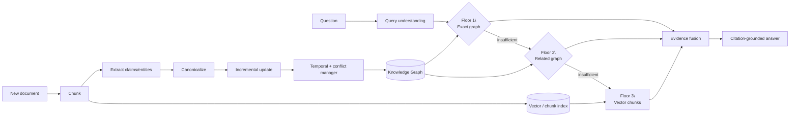

# LawGraph-PK

**Temporal and Conflict-Aware Incremental Hierarchical Graph-RAG for Evolving Legislation**

LawGraph-PK is a research implementation that combines two ideas:

1. **Incremental knowledge-graph RAG:** new documents update only affected graph state instead of rebuilding everything.
2. **Hierarchical retrieval:** a query starts with narrow graph evidence, expands to related graph evidence, and finally falls back to document/vector retrieval when necessary.

The research extension adds **temporal claim versioning, provenance and conflict-aware updates** so that legal amendments do not silently erase history or produce stale answers.

> **Research status:** The local comparison harness is complete. Real PDFs, LLM extraction, verified Pakistani legal data, production stores and the full research evaluation are next.

## Architecture



See [docs/ARCHITECTURE.md](docs/ARCHITECTURE.md) for the full design.

## Research question

> Can an incrementally maintained temporal knowledge graph answer evolving legal questions accurately while reducing update work compared with rebuilding the graph after every document batch, and can hierarchical fallback retrieval recover evidence when exact graph retrieval fails?

The project is anchored in the ideas of **LightRAG: Simple and Fast Retrieval-Augmented Generation** (Findings of EMNLP 2025), but is explicitly a **small-scale reproduction and domain extension**, not a claim of exact reproduction.

- Paper: https://aclanthology.org/2025.findings-emnlp.568/
- Project: https://lightrag.github.io/
- Reference implementation: https://github.com/HKUDS/LightRAG

## Quick start with `uv`

```bash
uv sync --extra dev
uv run pytest
uv run lawgraph demo
uv run lawgraph evaluate
uv run lawgraph compare
uv run uvicorn lawgraph_pk.api:app --reload
```

`lawgraph compare` runs the deterministic benchmark comparing vector-only, rebuild Graph-RAG, incremental Graph-RAG and the proposed temporal + hierarchical system.

Open <http://127.0.0.1:8000> for the small browser demo.

## Current implementation

The local implementation intentionally avoids external services:

- Python 3.11+
- FastAPI + Pydantic
- SQLite
- deterministic hash embeddings
- deterministic `subject | predicate | object` extraction
- temporal supersession and historical `as_of` queries
- three-floor hierarchical retrieval
- vector-only and static graph baselines
- reproducible comparison/evaluation harness
- pytest

This makes the core research logic reproducible without an API key.

## Current comparison result

The synthetic benchmark currently shows the proposed system with roughly **0.89 answer accuracy** versus **0.44** for both the flat vector and static graph baselines. The incremental indexer also processes about **78% fewer chunks** and **79% fewer claims** than rebuilding after every update in the benchmark stream.

These are **prototype validation results, not research claims**. The benchmark is synthetic and intentionally small. See [docs/EXPERIMENT_RESULTS.md](docs/EXPERIMENT_RESULTS.md).

## Repository map

```text
src/lawgraph_pk/
  models.py       # domain models
  text.py         # canonicalization/chunking/test embeddings
  extraction.py   # ClaimExtractor interface + fixture extractor
  store.py        # SQLite persistence + temporal chunk helpers
  ingestion.py    # incremental indexing + temporal updates
  retrieval.py    # temporal hierarchical retrieval
  baselines.py    # vector-only + static graph baselines
  evaluation.py   # retrieval/answer metrics
  experiment.py   # deterministic comparison benchmark
  service.py      # dependency wiring
  api.py          # FastAPI API
  cli.py          # demo/evaluation/comparison CLI

docs/
  ARCHITECTURE.md
  EXPERIMENT_PROTOCOL.md
  EXPERIMENT_RESULTS.md
  IMPLEMENTATION_PLAN.md
  PAPER_NOTES.md
  RESEARCH_SPEC.md
  STATUS.md
  DEVELOPMENT.md
  LLM_HANDOFF.md

AGENTS.md           # instructions for future coding agents/LLMs
PROJECT_CONTEXT.md  # project memory and research intent
TODO.md             # active work list
CHANGELOG.md        # implementation history
```

## Research systems

| ID | System | Purpose |
|---|---|---|
| B1 | Vector-only RAG | Flat retrieval baseline |
| B2 | Rebuild Graph-RAG | Graph retrieval without incremental optimization |
| B3 | Incremental Graph-RAG | Same graph retrieval with incremental maintenance |
| Ours | Temporal + Hierarchical Graph-RAG | Incremental + temporal + hierarchical extension |

## Important limitation

The included benchmark data is fictional. Nothing in this repository is legal advice. Real legal documents must be sourced responsibly, with provenance and licensing recorded, and evaluation ground truth must be human-verified.

## Continuing the project with another LLM

Start with:

1. `AGENTS.md`
2. `PROJECT_CONTEXT.md`
3. `docs/LLM_HANDOFF.md`
4. `docs/STATUS.md`
5. `docs/RESEARCH_SPEC.md`
6. `docs/ARCHITECTURE.md`
7. `docs/EXPERIMENT_PROTOCOL.md`
8. `TODO.md`

Those files are intentionally maintained as project handoff documentation.
