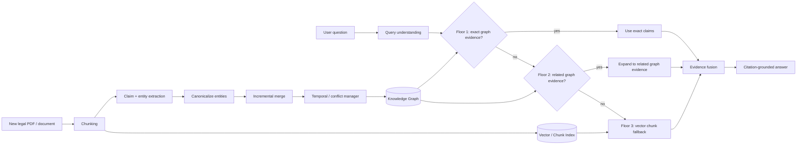

# Architecture

## High-level design



## Two dimensions of the system

The important conceptual distinction is that **incremental indexing** and **hierarchical retrieval** solve different problems.

```text
                 WHEN KNOWLEDGE CHANGES
                         |
                         v
              INCREMENTAL INDEXING
                         |
          update only affected graph state
                         |
                         v
                 Knowledge Base
                         |
                         v
                    USER QUERY
                         |
                         v
              HIERARCHICAL RETRIEVAL
                         |
          +--------------+--------------+
          |              |              |
       Floor 1        Floor 2        Floor 3
       exact          related        chunks
       graph          graph          vector
          |              |              |
          +--------------+--------------+
                         |
                         v
                 Evidence + citations
```

## Retrieval floors

### Floor 1 — Exact

Identify entities explicitly mentioned in the question and retrieve current claims attached to them.

Use this for questions such as:

> What does Section 10 require?

### Floor 2 — Related

If exact evidence is insufficient, expand to one-hop neighbors and their claims.

Useful for:

> Which amendment changed Section 10, and what else does that amendment affect?

### Floor 3 — Vector fallback

If graph evidence is missing or insufficient, retrieve semantically similar document chunks.

This protects against extraction errors and queries that mention concepts rather than canonical graph entities.

## Future production architecture

The local SQLite implementation should remain the reference implementation for tests. Production adapters should be added behind interfaces:

- Neo4j — graph storage
- PostgreSQL + pgvector — vectors, metadata and evaluation data
- PDF parser — source documents and page/evidence spans
- LLM structured extractor — entities, relations, claims and confidence
- reranker — optional retrieval refinement

The system should support running experiments against the same dataset with different backends.
